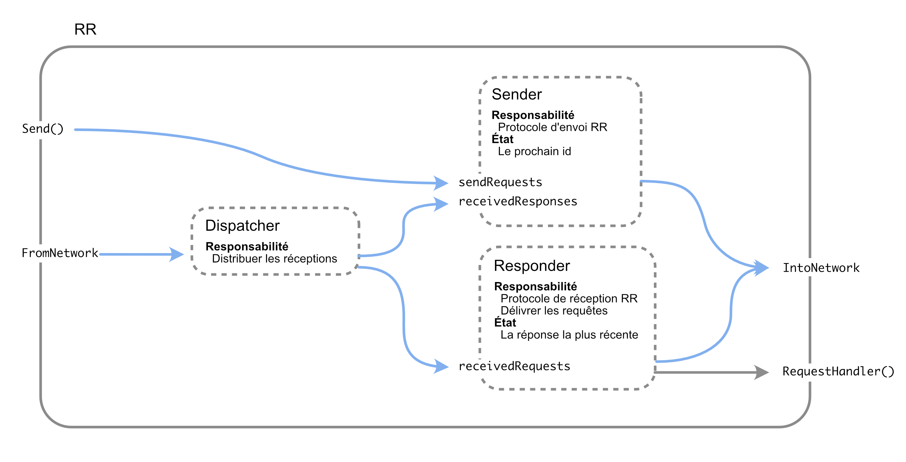
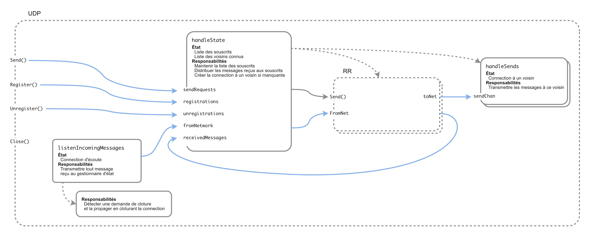

# Document d'Architecture Logicielle - Labo 1

Ce document décrit la solution au labo 1, et vise notamment à servir d'exemple du type de document attendu. Nous y décrivons aussi notre raisonnement ; ceci n'était pas attendu dans votre document, mais pourra vous montrer différentes manières de concevoir une architecture logicielle.

## RR

En savoir plus sur le raisonnement...

> L'implémentation du module RR a été approchée de la manière suivante.
> 
> L'observation est qu'il a deux entrées (`SendRequest` et `FromNet`), et deux sorties (`ToNet` et l'appel au request handler).
> La question est de relier ces entrées et ces sorties, via des messages transmis par des channels entre goroutines. On parcourt donc méthodiquement les entrées et sorties.
>
> - Lors d'un appel à `SendRequest`, une goroutine doit envoyer la requête, et attendre la réponse. Elle aura donc besoin de recevoir les messages de type réponse du réseau.
> - Puisque celle-ci n'a besoin que des réponses, une autre goroutine doit faire le tri des messages reçus du réseau, et de les dispatcher aux bonnes goroutines.
> - L'autre resposnabilité de RR est de répondre aux requêtes reçues ; une troisième goroutine traite donc ces messages, transmis par la goroutine de dispatching.
> - Toutes les responsabilités sont ainsi couvertes. Aucune donnée n'est partagée, écartant le risque de race condition. On s'assure aussi qu'aucune interdépendance entre les goroutines ne peut causer de deadlock. En particulier, on remarque qu'il reste possible de répondre aux requêtes même lorsque l'envoi d'une requête est en cours, puisque ces deux responsabilités sont séparées en deux goroutines distinctes.
>
> Notez qu'une autre approche pouvait pemettre d'atteindre cette même architecture, en partant d'une solution simpliste, et en la corrigeant jusqu'à obtenir une solution correcte :
>
> - Donnons toute la responsabilité à une seule goroutine, qui lit les messages du réseau, et traite les appels à `SendRequest`.
> - Il faut alors considérer les besoins de concurrence du module : "qu'est-ce qui *doit* pouvoir se passer en même temps ?".
> - On remarque que lorsqu'une requête est en cours d'envoi et en attente de réception d'une réponse, le module doit continuer de pouvoir traiter les requêtes reçues.
> - Deux solutions se présentent à nous :
>     1. utiliser une structure dans laquelle stocker les requêtes en attente, pour pouvoir gérer d'autres événements (e.g. réception de requêtes) en attendant la réponse, et les retrouver dans cette structure au moment venu ;
>     2. séparer les responsabilités en deux goroutines, une pour l'envoi des requêtes, et une pour la réception des requêtes, de manière à ce qu'un blocage de la première n'empêche pas la seconde d'avancer. Une troisième goroutine de dispatching est alors nécessaire en amont. C'est la solution que nous avons choisie.
> - Notez que les deux sont valides ; la seconde tire plus profit des goroutines, mais la première reste fonctionnelle en utilisant une approche plus traditionnelle.

L'implémentation du module RR utilise trois goroutines :

- Une goroutine `handleSendRequests` responsable de l'envoi des requêtes, et donc du protocole de renvoi jusqu'à réception d'une réponse,
- Une goroutine `handleReceiveRequests` responsable de la réception de requêtes, et donc de la passation à la couche utilisatrice de RR et de l'envoi des réponses.
- Une goroutine `dispatchFromNetwork` responsable de recevoir les messages du réseau, et les transmettre aux goroutines concernées ; `handleSendRequests` recevra les réponses, et `handleReceiveRequests` recevra les requêtes.

Ces communications se font via des channels :

- `receivedResponses` et `receivedRequests` permettent à la goroutine de dispatching de transmettre les messages reçus aux bonnes goroutines.
- `sendRequests` est utilisée par la méthode `SendRequest` pour transmettre les demandes d'envoi à `handleSendRequests`.

Une structure `sendRequest` existe pour modéliser une demande d'envoi, et encapsule un payload en bytes et une channel de réponse.
Elle représente la demande d'envoi transmise par `SendRequest()` à la goroutine `handleSendRequests`.
La channel de réponses qu'elle contient est retournée immédiatement par `SendRequest()`, qui n'est donc pas bloquante. L'appelant pourra ensuite attendre sur
cette channel pour recevoir la réponse à sa requête. Cette réponse sera écrite dans la channel par `handleSendRequests`
au moment où elle est reçue.

`handleSendRequests` et `handleReceiveRequests` écrivent toutes les deux dans `IntoNet` lorsqu'elles veulent envoyer une requête ou une réponse, respectivement.
`handleReceiveRequests` appelle le request handler lorsqu'une requête est reçue.

Le diagramme suivant illustre l'architecture de notre implémentation :

## Intégration dans UDP

En savoir plus sur le raisonnement...

> Pour l'intégration de RR dans UDP, on fait les observations suivantes, desquelles on déduit la solution.
> 
> - UDP gère déjà la multiplicité des destinataires via les goroutines `handleSends`, le stockage de channels associées dans une map de la goroutine principale `handleState`, et la création paresseuse de nouvelles connexions (goroutine et entrée dans la map).
> - Puisque chaque instance de RR est associée à une seule adresse distante, il en faudra une par voisin, ce qui ressemble beaucoup aux goroutines `handleSends` déjà présentes. On peut donc supposer que ces instances seront gérées par la goroutine principale de la même manière que les goroutines `handleSends`. Notez qu'on ne placera pas RR *à la place de* ni "après" `handleSends`, puisque RR abstrait le réseau derrière un `NetWrapper`, et que l'envoi effectif sur la connexion (comme le fait actuellement `handleSends`) devra continuer d'être fait par UDP.
> - La question devient alors : "comment connecter les 2 entrées et 2 sorties de chaque instance RR aux bons endroits dans UDP ?".
>     - `ToNet` doit être lue par une goroutine qui sera responsable d'envoyer les messages sur la connexion UDP. C'est exactement le rôle actuel de `handleSends`, qui peut donc lire dans `ToNet` au lieu de sa channel actuelle.
>     - Le request handler, fourni par UDP et décrivant le comportement à avoir lorsqu'une requête est reçue, doit appeler le bon handler de UDP. Ce dernier est stocké dans une map de la goroutine principale ; c'est donc elle qui devra se charger de trouver et appeler le bon handler, comme elle le fait déjà. Le message doit donc être transmis à celle-ci, pour qu'elle puisse faire cet appel.
>     - `SendRequest()` doit être appelée pour chaque message à envoyer. La goroutine principale est déjà responsable de ceci, c'est donc elle qui appellera `SendRequest()`, au lieu de transférer le message au `handleSends` correspondant. Les instances de RR seront donc stockées dans une map de la goroutine principale.
>     - `FromNet` doit recevoir les messages destinés à *cette* instance de RR. Il est donc nécessaire de faire du "routage", puisque `listenIncomingMessages` reçoit les messages de toutes les sources. Il ne pourra pas faire ce routage lui-même, puisqu'il ne connaît pas les instances de RR. Cette information est maintenue par la goroutine principale ; `listenIncomingMessages` lui transmettra donc les messages reçus, et elle les transfèrera au `FromNet` de la bonne instance RR. Ces `FromNet` seront donc également stockés dans une map de la goroutine principale.
> 
> Un dernier point important vient de la contrainte que le `Send` de `udp` doit être bloquant. Lorsqu'il transmet une demande d'envoi à la goroutine principale, il doit attendre la réponse à sa requête avant de pouvoir retourner. Ceci doit, en plus, être fait sans bloquer la goroutine principale.
> 
> On sait que `RR.SendRequest()` retourne sans bloquer une channel sur laquelle sera écrite la réponse. Puisque, dans l'attente de cette réponse, rien ne doit bloquer à part `udp.Send()`, l'objectif est que ce soit `udp.Send()` qui écoute cette channel.
> Pour ce permettre, la demande d'envoi transmise par `udp.Send()` à la goroutine principale contiendra une channel sur laquelle cette dernière pourra transmettre la channel retournée par `RR.SendRequest()`. Ainsi, `udp.Send()` attendra sur celle-ci, jusqu'à ce que `RR` y écrive la réponse une fois obtenu, sans impacter la goroutine principale.

L'intégration de RR dans UDP se fait sans l'ajout d'aucune nouvelle goroutine. Une instance est créée pour chaque adresse distante, de la même manière paresseuse que les goroutines `handleSends` actuelles. La map des `sendChans` actuelle est donc remplacée par une map d'instances de RR et de leur `FromNet` respectives. Chaque instance de RR est ensuite connectée à UDP de la manière suivante :

- La channel `ToNet` est passée à la goroutine `handleSends`, qui continue d'être responsable de l'envoi des messages sur la connexion UDP.
- Le request handler écrit dans la channel `receivedMessages`, que la goroutine principale lit déjà.
- Pour la channel `FromNet`, stockée dans la map de la goroutine principale, celle-ci y écrit les messages transmis par `listenIncomingMessages`, après avoir trouvé la bonne instance de RR dans la map.
- Enfin, pour la méthode `SendRequest()` de RR, la goroutine principale l'appelle lorsqu'elle reçoit une demande d'envoi de la part de `udp.Send()`. Afin d'éviter de bloquer la goroutine principale, `udp.Send()` transmet une channel avec sa demande, sur laquelle la goroutine principale enverra la channel retournée par `RR.SendRequest()`. `udp.Send()` la recevra et attendra, avant de retourner, la réponse que l'instance RR y écrira, une fois reçue.

Enfin, puisque la goroutine `listenIncomingMessages` reçoit des messages qui ne sont pas encore destinés à la couche utilisatrice de UDP, mais à une instance RR, elle ne peut plus les envoyer sur `receivedMessages`. Elle les envoie donc sur une nouvelle channel, `fromNetwork`, que la goroutine principale lit afin de les transmettre au `FromNet` de la bonne instance de RR.

Le diagramme suivant illustre l'architecture de notre implémentation :

