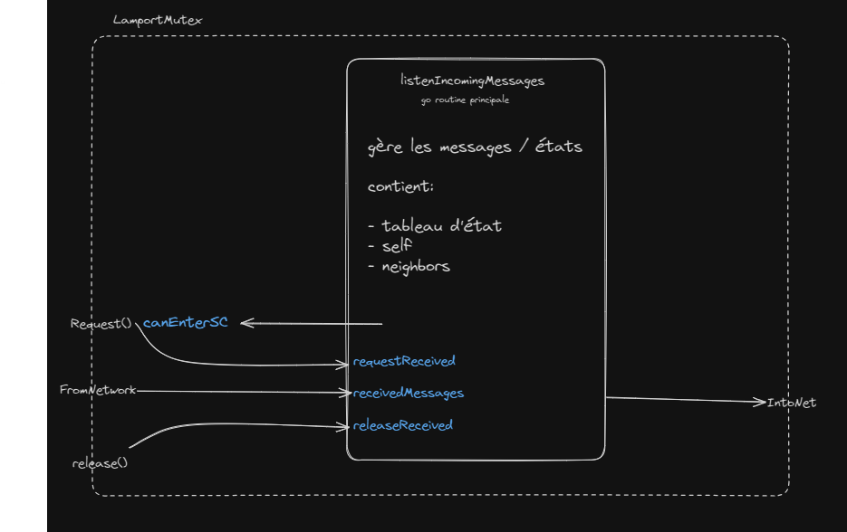

# Document d'Architecture Logicielle

## Architecture du module LamportMutex

L'implémentation du module LamportMutex nécessite une seule goroutine nommée `listenIncomingMessage`.

Cette dernière gère les points suivants:
- Réceptions messages venant du réseau;à savoir REQ, REL, ACK
- Garder l'état du self ainsi que des neighbors et les mettre à jour selon les messages reçu
- Transmettre la demande d'utilisation de la section critique aux voisins
- Transmettre la fin de l'utilisation de la section critique aux voisins

Puisque nous avons une seule goroutine qui gère nos états, nous sommes sûrs qu'auncun état ne sera accédé de manière concurrente par plusieurs goroutines.

Les communications entre `Request()`, `release()` et `listenIncomingMessage()` se font via les channels suivantes:

- `receivedMessages`: contient les messages venus du réseau fromNet
  - lue par: routine `listenIncomingMessages()`
  - écrite par: routine `listenIncomingMessages()`
- `requestReceived`: est remplie lors d'une demande d'utilisation de la section critique via l'appel à la méthode bloquante mutex.Request()
  - lue par: routine `listenIncomingMessages()`
  - écrite par: `Request()`
- `canEnterCS`: permet de débloquer la méthode bloquante mutex.Request() lorsque le champs est libre pour accéder à la section critique
  -  lue par: méthode `Request()`
  - écrite par: méthode `tryEnterCS()`(dans `listenIncomingMessage()`)
- `releaseReceived`: est remplie lors du retour de la méthode `Request()` qui est la fonction anonyme "`release()`" et signifie la fin de l'usage de la section critique
    - lue par: `listenIncomingMessages()`
    - écrite par: "`release()`" (fct de retour de `Request()`)

### Details de l'implémentation

- `listenIncomingMessage()` écrit dans IntoNet, que ce soit pour envoyer un ACK,REL ou REQ
- La méthode `mutex.Request()` est bloquante puisqu'elle souhaite lire la channel canEnterCS, et tant que cette channel n'aura pas de valeur (écrite par `listenInconmingMessage()` via `tryEnterCS()`) la méthode sera bloquée.

L'architecture du lamport Mutex est représenté par le schéma ci-dessous:

Le LamportMutex est un module qui vient s'intégrer entre la couche applicative et la couche réseau, c'est pourquoi il va garantir un ordre total des messages dans Chatsapp une fois intégré correctement.

## Intégration du LamportMutex dans le serveur

Concernant l'intérgration du mutex de Lamport dans le serveur, les modifications suivantes ont été faites:
- ajout d'un Mutex dans la struct Server
- ajout d'une méthode `createMutex()` (ainsi que son helper handleDispatchedMutexMessage)
- appel de la méthode `createMutex()` lors de l'appel à `NewServer()`
- ajout d'une Requête vers le Mutex (`mutex.Request()`) avant le broadcast dans la méthode `broadcast()`
- ajout d'un `defer release()` après la Request afin de lâcher le mutex lorsque le broadcast a été fait.

### Détails sur l'implémentation

L'architecture du mutex s'appuie sur deux channels distinctes (`netToMutex`, `mutexToNet`) qui relient le protocole Lamport à la couche réseau.
La méthode `createMutex` établit les channels de communication, initialise le mutex avec les identifiants de self et des voisins, et lance les routines de routage des messages entrants et sortants.
Le gestionnaire `handleDispatchedMutexMessage` adapte le protocole en transférant les messages du dispatcheur réseau vers le mutex via la channel dédiée, assurant une séparation nette des responsabilités et un flux de données asynchrone.

### Channels et go routines

Les channels servant à la communication avec le mutex de lamport: `netToMutex` et `mutexToNet`.
La gotoutine anonyme se trouvant dans createMutex() va s'occuper de lire les messages provenant du mutex et de les transmettre aux destinataires.

